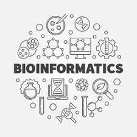

# Portfolio

***
## 1. What I aspect to learn?    
Bioinformatics has always been an interesting topic for me to study. This is a fairly new direction in science and often the terms of definition of what it is 
in my head get mixed up with data science and genomics. I would like to finally understand what tools and languages are used in bioinformatics, to explore a new 
perspective on data processing and working with them. And also find out what career paths are possible for bioinformatics.

## 3. Summary of an attended conference. 
### Clara Inserte: clevR-vis: Innovative visualization techniques for clonal evolution
Clonal evolution begins from mutations in a single cell that continue to transform and expand into an intratumor heterogeneity. There are several clonal evolution models that describe how it happens and the main paths are linear and branching models. A linear model results in a linear architecture with stepwise accumulation of driver mutations. There is a predominant clone in the cells. Within a branching model several genome changes occur through divergent mutational pathways.

For a reconstruction of a clonal evolution we should firstly obtain the data from a sample and then provide a clustering to show which mutants do we have and how many percentages of each group. After it we are able to reconstruct the model and visualize the data. Two main ways of visualization are Fishplot and Timescape. And there are some advantages as well as disadvantages of each tool but basically both are not perfect. According to this evidence, the main objectives of Clara’s work were to overcome the current visualization shortcomes and develop 3 different types of plots with an interactive interface. 
ClevR-vis pipeline takes as an input CCFs table with the underline of parental relations and then with the seaObject we are able to visualize the data with one of three possible plots. The main improvements of the existing visualization methods were the ability to add information about the therapy effect. We can show the effect that was applied at a certain point in time and this will show a more accurate visualization in a dolphin plot. Then the creation of a plaice plot. It has an ability to provide information about the alleles and so we can understand if there are still healthy allele variants or if it is a completely non-functional unit of information. Moreover we are able to combine several plots in a page and archive more accurate information for different points of view. Finally, the interface of the whole tool is user friendly and even a person without any bioinformatics knowledge is able to use the ClevR-vis. 

In conclusion, Clara introduced us to the theoretical part of how clonal evolution takes place and demonstrated what disadvantages there are in widely used tools. Thanks to this, she was able to create an easy-to-use new approach that also allows you to get more information about mutations and, accordingly, to transfer treatment approaches to a new level.

## 4. Final discussion: what did I learnt? 
Due to this course I have studied specific tools for working with data. I was able to get acquainted with the Linux language and the main ways of data visualization. Then I was able to put my knowledge into practice to work with the genome. Specifically, I studied the GWAS method and Transcriptomic analyses. During the course, we worked in a group, which allowed us to distribute teamwork competently. In addition to practical knowledges, conferences with invited participants have significantly broadened my horizons. It was very interesting to see the real stories of people and how they work in the bioinformatics environment.
